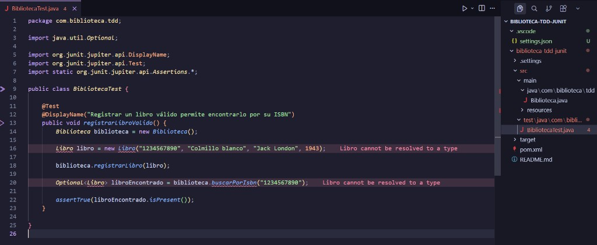
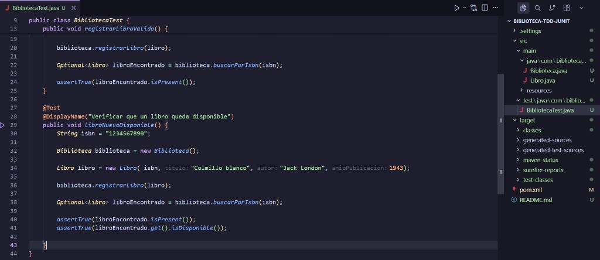
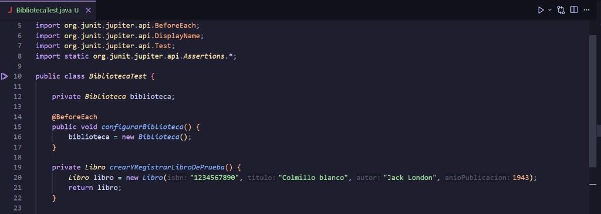
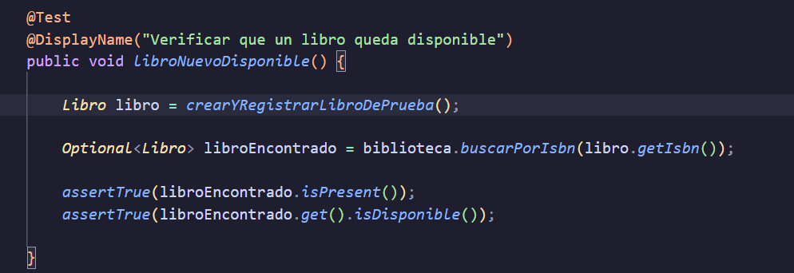
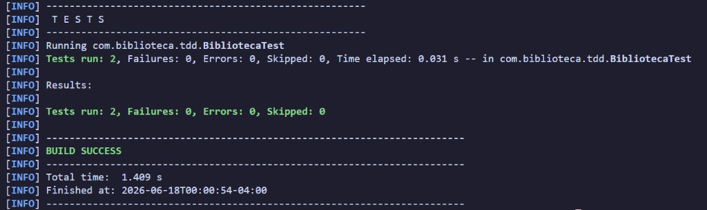
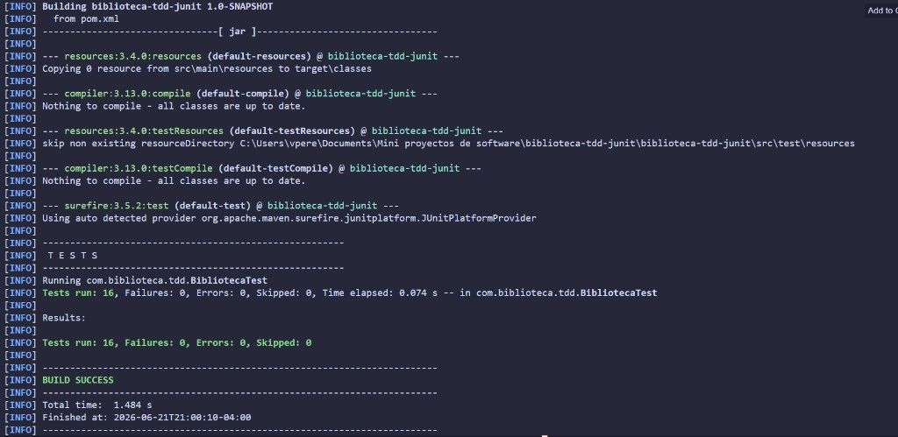

# biblioteca-tdd-junit

Práctica de **Test-Driven Development (TDD)** con Java 21 y JUnit 5. El proyecto modela una biblioteca simple donde se pueden registrar libros, buscarlos por ISBN o título, listar los disponibles, y gestionar préstamos y devoluciones.

## Descripción del proyecto

Las clases principales son:

- `Biblioteca` — Lógica de negocio (registro, búsqueda, préstamo y devolución).
- `Libro` — Entidad con ISBN, título, autor, año de publicación y estado de disponibilidad.
- `BibliotecaTest` — Suite de tests que define el comportamiento esperado del sistema.

## Aplicación de TDD

El desarrollo siguió el ciclo **Red → Green → Refactor** de forma incremental:

1. **Red** — Se escribió un test que describe un comportamiento concreto (por ejemplo, registrar un libro y encontrarlo por ISBN). Al inicio, el test fallaba porque la funcionalidad aún no existía.
2. **Green** — Se implementó el código mínimo necesario para que el test pasara, sin añadir lógica extra.
3. **Refactor** — Una vez en verde, se mejoró la estructura del código (extracción de excepciones propias, uso de `HashMap` indexado por ISBN, métodos auxiliares en los tests) manteniendo todos los tests pasando.

El orden de implementación fue guiado por los tests: primero el registro y la búsqueda básica, luego las validaciones de datos, después la búsqueda por título y el listado de disponibles, y finalmente el ciclo de préstamo y devolución con sus casos de error. Cada nueva funcionalidad comenzó con un test que actuó como especificación ejecutable.

## Decisiones de diseño

| Decisión | Motivación |
|----------|------------|
| **Almacenamiento en memoria** | El alcance del ejercicio es la lógica de dominio; no se implemento persistencia en base de datos. Se usa un `HashMap<String, Libro>` para almacenar libros de la biblioteca |
| **ISBN como clave** | El ISBN identifica de única el libro respectivo. `HashMap<String, Libro>` permite realizar operaciones básicas como buscar y insertar en tiempo constante O(1). |
| **Excepciones de dominio propias** | Cada error de negocio tiene su excepción (`DatosInvalidosException`, `LibroDuplicadoException`, etc.) para comunicar con claridad la causa del fallo. |
| **Libro disponible por defecto** | Al registrarse, un libro inicia con `disponible = true`, reflejando que entra a la biblioteca listo para préstamo. |
| **Búsqueda por título flexible** | `buscarPorTitulo` admite coincidencia parcial e ignora mayúsculas/minúsculas, facilitando búsquedas del usuario. |
| **`Optional` en búsqueda por ISBN** | Cuando el libro existe, `buscarPorIsbn` devuelve un `Optional<Libro>`. Si no existe, lanza `LibroNoEncontradoException`. |
| **Estado mutable en `Libro`** | La disponibilidad se modifica con `setDisponible` al prestar o devolver, manteniendo la entidad como fuente de verdad del estado. |
| **`@BeforeEach` en tests** | Cada test parte de una `Biblioteca` vacía, garantizando independencia entre casos de prueba. |

## Casos de prueba implementados

La suite `BibliotecaTest` contiene **16 tests** organizados por funcionalidad:

### Registro de libros

| Test | Descripción |
|------|-------------|
| `registrarLibroValido` | Registrar un libro válido permite encontrarlo por su ISBN. |
| `libroNuevoDisponible` | Un libro recién registrado queda disponible para préstamo. |
| `noRegistrarLibroConIsbnVacio` | Rechaza registro con ISBN vacío o `null`. |
| `noRegistrarLibroConTituloVacio` | Rechaza registro con título vacío o `null`. |
| `noRegistrarLibroConIsbnDuplicado` | Rechaza registrar dos libros con el mismo ISBN. |

### Búsqueda

| Test | Descripción |
|------|-------------|
| `buscarLibroPorIsbn` | Encuentra un libro existente por su ISBN. |
| `buscarLibroInexistentePorIsbn` | Lanza excepción al buscar un ISBN que no existe. |
| `buscarLibroPorCoincidenciaParcialDelTitulo` | Encuentra libros cuyo título contiene el texto buscado. |
| `buscarLibroPorTituloSinDiferenciarMayusculasYMinusculas` | La búsqueda por título no distingue mayúsculas de minúsculas. |

### Disponibilidad y listado

| Test | Descripción |
|------|-------------|
| `listarLibrosDisponibles` | Devuelve solo los libros que no están prestados. |

### Préstamo

| Test | Descripción |
|------|-------------|
| `prestarLibroDisponible` | Prestar un libro disponible lo marca como no disponible. |
| `noPrestarLibroInexistente` | Lanza excepción al intentar prestar un ISBN inexistente. |
| `noPrestarLibroQueYaEstaPrestado` | Lanza excepción al intentar prestar un libro ya prestado. |

### Devolución

| Test | Descripción |
|------|-------------|
| `devolverLibroPrestado` | Devolver un libro prestado lo marca como disponible nuevamente. |
| `noDevolverLibroInexistente` | Lanza excepción al intentar devolver un ISBN inexistente. |
| `noDevolverLibroQueYaEstaDisponible` | Lanza excepción al intentar devolver un libro que ya estaba disponible. |

## Instrucciones de ejecución

### Requisitos previos

- Java 21 o superior
- Apache Maven 3.6+
- GNU Make (opcional). En Windows puedes instalarlo con [Chocolatey](https://chocolatey.org/) (`choco install make`), Git Bash o WSL.

Verifica que Java y Maven estén disponibles:

```bash
java -version
mvn -version
```

### Compilar

Con Make:

```bash
make compile
```

Con Maven:

```bash
mvn compile
```

### Ejecutar tests

Con Make:

```bash
make test      # Compila y ejecuta todos los tests
make all       # Equivalente a make test (objetivo por defecto)
```

Con Maven:

```bash
mvn test           # Compila y ejecuta los tests
mvn clean test     # Limpia artefactos previos y ejecuta desde cero
```

Los reportes de Surefire se generan en `target/surefire-reports/`.

### Limpiar artefactos

```bash
make clean
# o
mvn clean
```

### Generar JAR (sin tests)

```bash
make package
# o
mvn package -DskipTests
```

## Preguntas de reflexión

## Pregunta 1

*"Describe brevemente cómo aplicaste el ciclo TDD (Red → Green → Refactor) durante el desarrollo del ejercicio.*"

*"Incluye un ejemplo concreto de una funcionalidad donde primero escribiste la prueba, luego implementaste el código mínimo para hacerla pasar y finalmente realizaste una refactorización.*"

Durante el ejercicio seguí el ciclo **Red → Green → Refactor** de forma incremental: no construí todo el sistema de una vez, sino que avancé **test por test**, repitiendo el ciclo en cada etapa. Las funcionalidades se implementaron en este orden:

1. **Registro de libros** — Creación de `Biblioteca` y `Libro`, registro básico, validaciones de datos (ISBN/título vacíos, ISBN duplicado) y disponibilidad por defecto.
2. **Búsqueda de libros** — Búsqueda por ISBN, búsqueda por título (coincidencia parcial, sin distinguir mayúsculas) y listado de libros disponibles.
3. **Préstamo de libros** — Marcar un libro como prestado y rechazar préstamos inválidos (ISBN inexistente, libro ya prestado).
4. **Devolución de libros** — Restaurar la disponibilidad de un libro devuelto y rechazar devoluciones inválidas (ISBN inexistente, libro ya disponible).

Cada etapa se apoyó en la anterior: no tiene sentido probar un préstamo si aún no existen libros registrados y buscables.

Como ejemplo concreto del ciclo TDD, tomo el test `libroNuevoDisponible()` de la primera etapa, que verifica que un libro recién registrado queda disponible para préstamo.

**Red.** Escribí el test antes de pensar en cambios adicionales al código. A diferencia del primer test (`registrarLibroValido()`), este no partió en rojo de compilación: en el primer ciclo TDD ya se habían creado las clases `Biblioteca` y `Libro`, junto con los métodos `registrarLibro` y `buscarPorIsbn`, que eran el código mínimo para hacer pasar el test inicial. Aun así, el test cumplió su rol de **especificación**: dejó explícito un nuevo comportamiento esperado (disponibilidad por defecto) que antes no estaba verificado de forma aislada.

**Green.** Al ejecutar el test, pasó de inmediato porque la implementación mínima previa ya contemplaba que un `Libro` nuevo tenga `disponible = true`. No fue necesario escribir código extra; el test confirmó que el comportamiento existente era el correcto.

**Refactor.** Con dos tests en verde, la suite empezó a repetir lógica de preparación (crear `Biblioteca`, instanciar `Libro`, registrarlo). Refactoricé los tests extrayendo un `@BeforeEach` que inicializa una biblioteca limpia en cada caso, y un helper privado `crearYRegistrarLibroDePrueba()` que centraliza la creación y registro del libro de prueba. Así, `libroNuevoDisponible()` quedó más legible y enfocado en lo que realmente prueba: que el libro encontrado esté disponible.

Este ejemplo muestra que TDD no siempre implica un fallo visible en cada test nuevo; a medida que avanza el desarrollo, los tests siguen guiando el diseño y la refactorización, incluso cuando el código mínimo ya existe gracias a ciclos anteriores.

## Pregunta 2

*"¿Qué ventajas y desventajas observaste al desarrollar utilizando TDD en comparación con implementar primero el código y luego las pruebas?*"

*"Fundamenta tu respuesta utilizando ejemplos de tu experiencia durante el desarrollo de este ejercicio.*"

### Ventajas

Entre las ventajas que pude observar es que al aplicar TDD solamente me debía enfocar en implementar la lógica minima para que el test pasara. Siempre teniendo en mente escribir primero que debía ocurrir (definido por el test) y luego escribir el código necesario para que esto ocurra como era esperado. Esto evita perder el tiempo implementando lógica innecesaria o que no se ha pedido.

En `registrarLibroValido()` escribí primero qué debía ocurrir (registrar un libro y encontrarlo por ISBN) y recién después creé `Biblioteca`, `Libro` y los métodos necesarios. Si hubiera implementado el código primero, habría corrido el riesgo de agregar lógica que nadie pidió o de olvidar verificar el caso principal.

Por otro lado para poder implementar los test de préstamo y devolución el ciclo TDD te obliga a contemplar escenarios de error desde el inicio: ISBN inexistente, libro ya prestado o ya disponible. Lo cúal facilita la detección temprana de errores y casos límite. Cuando escribimos el código primero y luego los test, es común posponer esos casos o no cubrirlos todos.

### Desventajas


Al principio, puede parecer que avanzas a la mitad de la velocidad normal porque estás escribiendo el doble de código (la prueba y la implementación). Por ejemplo, el primer test (`registrarLibroValido`) no compilaba hasta crear varias clases y métodos. En un enfoque código-primero, podría haberse avanzado más rápido en una primera versión funcional, aunque sin garantías de comportamiento.

Cambiar la mente para pensar primero en el escenario de prueba y luego en la solución es extremadamente contraintuitivo al principio. Por lo general estamos acostumbrados a escribir el código primero y luego los test.

En conclusión, TDD me costó más al arrancar, pero me dio un diseño más acotado, casos de error explícitos desde el principio y la tranquilidad de refactorizar sin romper comportamiento ya verificado.

## Pregunta 3

Si tuvieras que desarrollar nuevamente este sistema desde cero, ¿continuarías utilizando TDD? ¿Por qué?

Explica qué aprendizajes obtuviste respecto a:

* Calidad del software.
* Diseño de clases y métodos.
* Detección temprana de errores.
* Velocidad de desarrollo.
* Confianza al realizar cambios en el código.

## Evidencia

### Primer test en rojo (`registrarLibroValido`)

El primer test sí partió en rojo: la clase `Libro` aún no existía y el compilador reportaba el error *"Libro cannot be resolved to a type"*.



### Test `libroNuevoDisponible()` — versión inicial

Primera versión del test, con toda la preparación escrita de forma explícita dentro del método.



### Refactor — `@BeforeEach` y helper

Se extrajo la inicialización repetida a `@BeforeEach` y al método `crearYRegistrarLibroDePrueba()`.





### Ejecución en verde (etapa inicial)

Tras implementar y refactorizar las primeras funcionalidades, los dos primeros tests pasan correctamente (`Tests run: 2, Failures: 0`).



### Suite completa — todos los tests en verde

Al finalizar el ejercicio, la suite completa de `BibliotecaTest` pasa sin fallos: **16 tests, 0 failures, 0 errors**.


